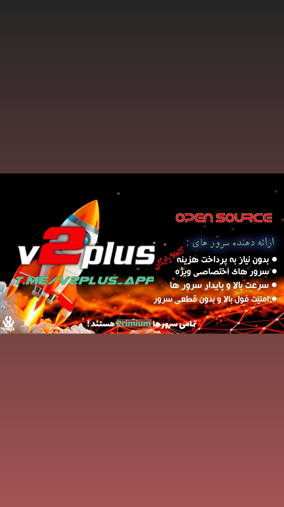
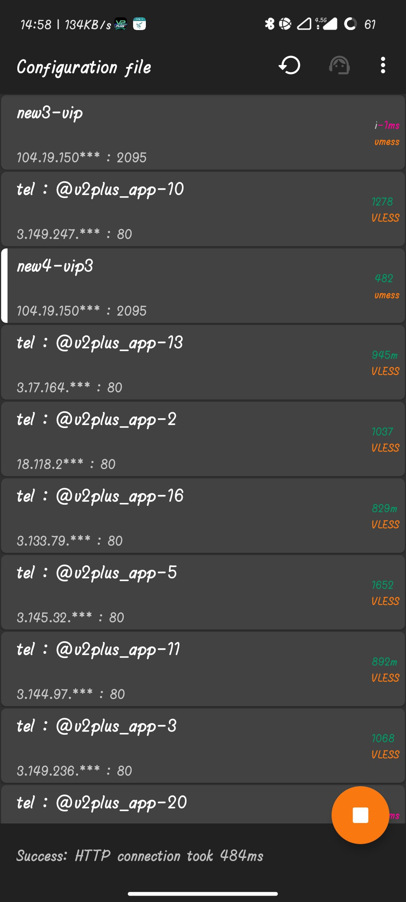
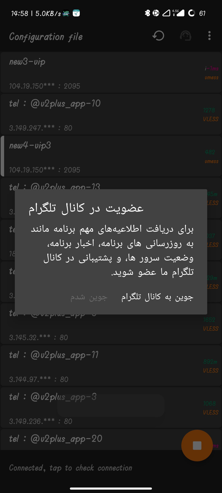
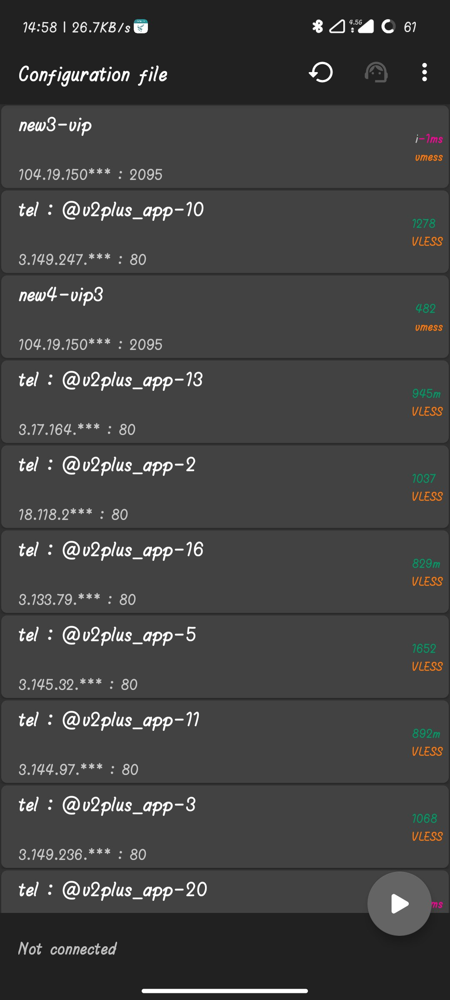
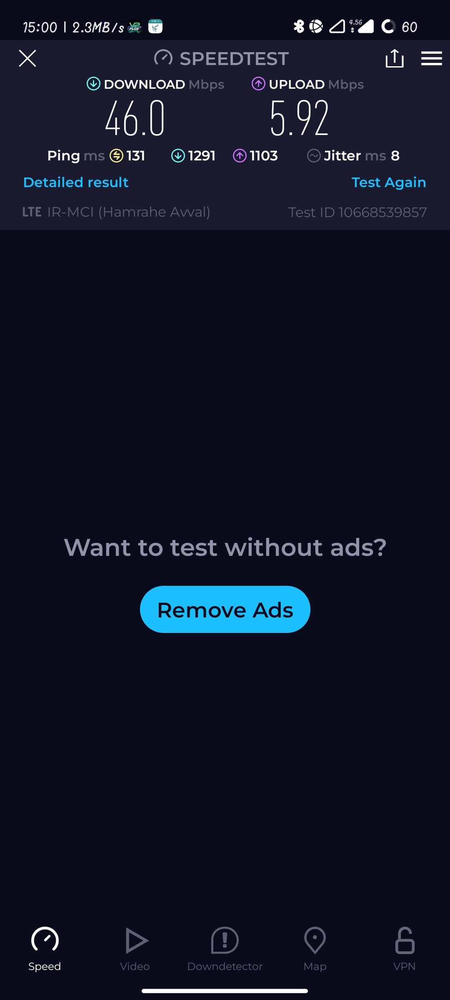

# ⚠️⚠️⚠️ توجه ⚠️⚠️⚠️

برای بارگذاری لیست سرورها باید فیلترشکن شما خاموش باشد

---

# فیلترشکن V2Plus – سریع، امن و بهینه

  

فیلترشکن V2Plus یکی از جدیدترین و پیشرفته‌ترین روش‌های دور زدن محدودیت‌های اینترنتی است که با بهره‌گیری از فناوری‌های مدرن، امنیت بالا، سرعت فوق‌العاده، و بهینه‌سازی مصرف منابع را برای کاربران فراهم می‌کند. این ابزار با استفاده از پروتکل‌های پیشرفته مانند VMESS، VLESS**، تجربه‌ای پایدار و بدون قطعی را برای کاربران فراهم می‌کند.

---

## 📸 **تصاویر برنامه

  
  
  

---

## ⚡️ تست سرعت

  

---

## 🔒 1. امنیت فوق‌العاده بالا

### 🔹 رمزگذاری پیشرفته
- V2Plus از رمزگذاری سرتاسری (End-to-End Encryption) استفاده می‌کند که باعث می‌شود داده‌های شما در مسیر انتقال غیرقابل شنود باشند.
- استفاده از الگوریتم‌های AES-256-GCM، ChaCha20، و Poly1305 برای حفاظت از داده‌ها، امنیت بالایی را تضمین می‌کند.

### 🔹 حفاظت از حریم خصوصی
- بدون نیاز به ثبت‌نام یا وارد کردن اطلاعات شخصی.
- عدم ذخیره‌سازی لاگ‌ها: سرورهای V2Plus هیچ‌گونه لاگی از فعالیت‌های کاربر ذخیره نمی‌کنند، بنابراین حریم خصوصی شما کاملاً حفظ می‌شود.

---

## ⚡️ 2. سرعت بسیار بالا

### 🔹 کاهش تأخیر (Latency Optimization)
- استفاده از پروتکل‌های سبک و سریع مانند VLESS که سربار کمتری نسبت به سایر پروتکل‌های وی‌پی‌ان دارد.
- بهینه‌سازی TCP و UDP برای عملکرد بهتر در هنگام استریم، دانلود، و بازی‌های آنلاین.
- استفاده از Multiplexing برای افزایش کارایی و کاهش زمان اتصال.

### 🔹 اتصال پایدار (Stable Connection)
- استفاده از تکنیک‌های Fast Open برای کاهش زمان برقراری اتصال.
- تنظیم خودکار مسیر (Routing Optimization) برای انتخاب سریع‌ترین و کم‌ترافیک‌ترین مسیر.

---

## 🛠 3. بهینه‌سازی و مصرف کم منابع

### 🔹 مصرف کم باتری و منابع سخت‌افزاری
- V2Plus به گونه‌ای طراحی شده که کمترین میزان مصرف پردازنده (CPU) و حافظه (RAM) را داشته باشد.
- حالت Low Power Mode برای کاربران موبایل که می‌خواهند مصرف انرژی کمتری داشته باشند.

### 🔹 پشتیبانی از تونل‌زنی پیشرفته
- امکان استفاده از Full Tunnel برای انتخاب مسیرهای مشخص برای ترافیک اینترنت.

### 🔹 دور زدن محدودیت‌های جغرافیایی
- امکان تغییر آی‌پی به سرورهای کشورهای مختلف برای دسترسی به محتوای قفل‌شده.

---

## 🎯 نتیجه‌گیری
فیلترشکن V2Plus با امنیت بالا، سرعت فوق‌العاده، و مصرف کم منابع یکی از بهترین گزینه‌ها برای کاربران حرفه‌ای و عمومی است. با استفاده از این ابزار، می‌توانید به اینترنت آزاد دسترسی داشته باشید، بدون نگرانی از فیلترینگ و افت سرعت. اگر به دنبال یک وی‌پی‌ان امن، سریع و قابل اطمینان هستید، V2Plus انتخاب ایده‌آلی خواهد بود.
